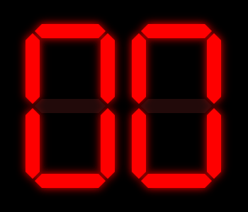
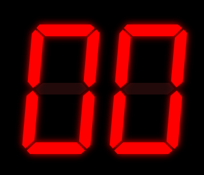

# React 7-Segment Display

A React component that simulates a 7-segment display.


## Usage

### Installation

`npm install react-7-segment-display`

### Adding the component to your project

```jsx
import { Display } from "react-7-segment-display";

const App = () => <Display value="77" />;

export default App;
```

## Props

| Name           | Decription                                                 | Type      | Default value |
| -------------- | ---------------------------------------------------------- | --------- | ------------- |
| value          | Value displayed on the display (in decimal or hexadecimal) | `any`     | `null`        |
| color          | Color of the display segments when turned on               | `string`  | `"red"`       |
| height         | Total height of the display digits                         | `number`  | `250`         |
| count          | Amount of digits on the display                            | `number`  | `2`           |
| bakgroundColor | Color of the background                                    | `string?` | n/a           |
| skew           | Whether the digits are skewed or not                       | `boolean` | `false`       |

### Valid values for `value`

You can dislay a number in decimal or hexadecimal, giving its value by a number or a string.



### Skew prop

`skew` is a boolean that determines whether the digits are skewed or not. You can use it to make the display look more like a real 7-segment display.



## License

MIT License
