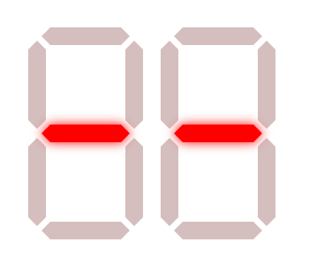

# React 7-Segment Display
A React component that simulates a 7-segment display.

## Props
- `value` - value displayed on the component
- `color` - color of the display segments when turned on
- `height` - total height of the display digits
- `count` - amount of digits on the display
- `bakgroundColor` - color of the background

## License
MIT